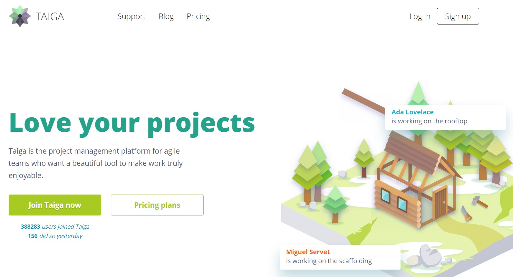

# 2. Semester Projekt

---
@title[GitHub Placering]

@snap[midtpoint span-100 text-07]
## GitHub Placering

Alt omkring semester projektet er samlet et sted:

[https://datsoftlyngby.github.io/dat2sem2020Spring/projekt/](https://datsoftlyngby.github.io/dat2sem2020Spring/projekt/)
@snapend

---
@title[Carporte]

@snap[north-west span-50 text-07]
## Carporte
@snapend

@snap[west span-70 text-08]
I skal programmere et system der skal erstatte Fog's nuværende system

@ul[...](false)
- Det skal være webbaseret
- Det skal være en carport som kunde selv *"designer"* - *altså mål, skur, tagtype osv.*
- Det skal være muligt for kunden at bestille en carport
@ulend
@snapend

@snap[south-east span-30 text-06]
*Jon og Casper har talt med kunden, det er der kommet en video ud af. Hvilket svarer til at i har holdt et møde med kunden, hvor i har fået opgaven.*
@snapend
---
@title[Kundemøde]
## Video fra kundemødet

---
@title[Møder]
@snap[north-west span-50 text-07]
## Møder
@snapend

@snap[midtpoint span-80 text-07]
| Dato  | Type                           |
|-------|--------------------------------|
|16-04  |SCRUM Planning                  |
|17-04  |SCRUM Planning                  |
|23-04  |SCRUM Review & Teknisk Feedback |
|24-04  |SCRUM Planning                  |
|30-04  |SCRUM Review & Teknisk Feedback |
|01-05  |SCRUM Planning                  |
|07-05  |SCRUM Review & Teknisk Feedback |
|14-05  |Teknisk Feedback                |
|18-05  |SCRUM Review                    |
@snapend

@snap[south span-100 text-04]
Tidsplanerne for de enkelte SCRUM møder ligger i et Google Sheet doc: [https://bit.ly/2_sem_2020_grupper](https://bit.ly/2_sem_2020_grupper)
@snapend

---
@title[SCRUM Møder Planning]
@snap[north-west span-100 text-07]
## SCRUM Møder - Planning
@snapend

@snap[west span-80 text-08]
I skal have følgende klar til SCRUM **Planning** møder:

@ul[...](false)
- Opdatert **Product Backlog**
- **Prioteret User Stories** i Product Backlog
- **Estimater User Stories** i Product Backlog
@ulend
@snapend

---
@title[SCRUM Møder - Review]
@snap[north-west span-80 text-07]
## SCRUM Møder - Review
@snapend

@snap[west span-80 text-08]
I skal have følgende klar til SCRUM **Review** møder:

@ul[...](false)
- Opdatert **Sprint Backlog**
- **Demo** af User stories
@ulend
@snapend

---
@title[SCRUM Møder - Retrospective]
@snap[north-west span-80 text-07]
## SCRUM Møder - Retrospective
@snapend

@ul[...](false)
- I afholder selv - som gruppe - Det Retrospective møde
- Hvad gik **godt** i dette sprint
- Hvad gik **ikke så godt** i dette sprint
@ulend
@snapend

---
@title[SCRUM Møder - Daily Scrum]
@snap[north-west span-80 text-07]
## SCRUM Møder - Daily
@snapend

@ul[...](false)
- Hver dag - **15 minutter**
- Hvem gør hvad - Er der nogle problemer ....
- Husk skriv lidt om hvert "Daily meeting"
@ulend
@snapend

---
@title[taiga.io]
@snap[north-west span-80 text-07]
## taiga.io
@snapend

@snap[west span-80 text-08]
I skal bruge et **program** til jeres **Product backlog**
@ul[...](false)
- I skal kunne vise:
    - User Stories
    - Priotering
    - Task
    - Status
- Vores anbefaling er:
    - [www.taiga.io](https://taiga.io/)
    - Gratis for:
    - *Unlimited public projects*
@ulend
@snapend

@snap[south-east span-55]

@snapend

